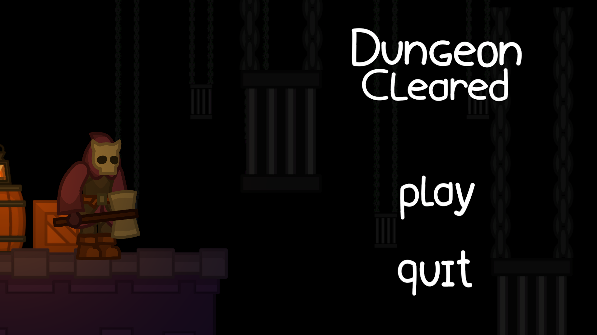
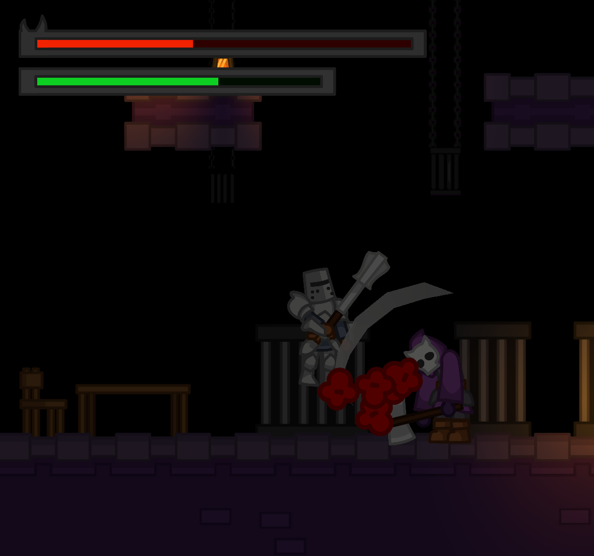

# Dungeon Cleared (not finished)

**Dungeon Cleared** est un un petit jeu de type platformer, développé sous Unity. 
- Le joueur contrôle un drôle d'énergumène, dans un donjon et se bat contre des chevaliers.
- Il n'y actuellement pas de gameplay loop ou de but réel si ce n'est atteindre la fin.
- Le but envisager, et qui donne du sens au titre du jeu, serait de réanimer les monstres du donjon qui ont été battus par les chevaliers, avec un système d'échange d'âme ou équivalent.

- La version actuelle permet toutefois de se déplacer dans les 4 salles du donjons et de se battre avec les ennemis.
- Les améliorations envisagées sont les suivantes : Système de sauvegarde, récolte de loot (âme) et intéraction avec les monstres, ajout d'une musique et de SFX, mise en pause du jeu.

## Technologies utilisées

- [Unity](https://unity.com/)
- C#

## Ce que j'ai appris

- Persistent Scene, Animator et Animations, TileSet et Rule Tiles, Trail Renderer et Particle System, utilisation de Cinemachine et Depth of Field.
  
## Sources

- J'ai fait le code et les sprites
